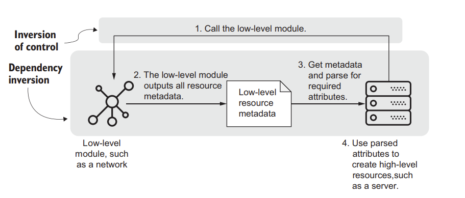

Dependency injection combines inversion of control and dependency inversion to loosen infrastructure dependencies and isolate low-level and high-level resources.

(Rosemary Wang - Infrastructure as Code Book)